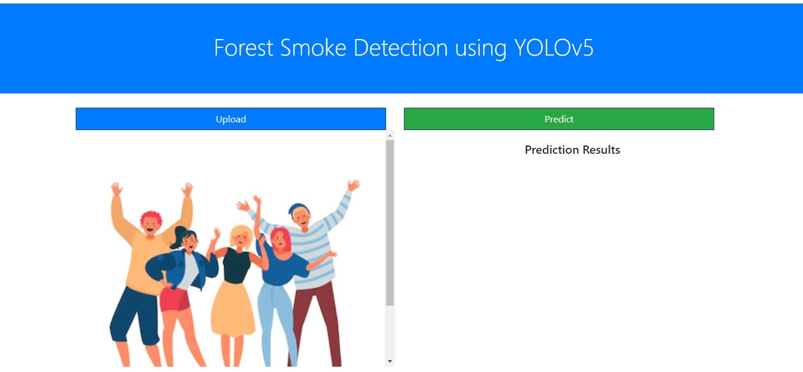
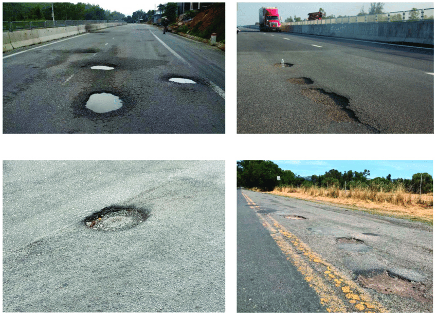
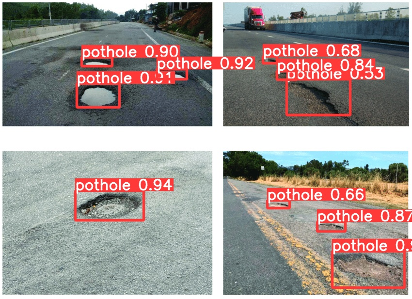

# Forest Smoke Detection WebApp using Yolov5

## How to run app?
### 1. Clone the repository
### 2. Install requirements.txt 
### 3. Run the clientApp.py file
  

## Webpage -

 

## Input Image -

 

## Predicted Image -

 
